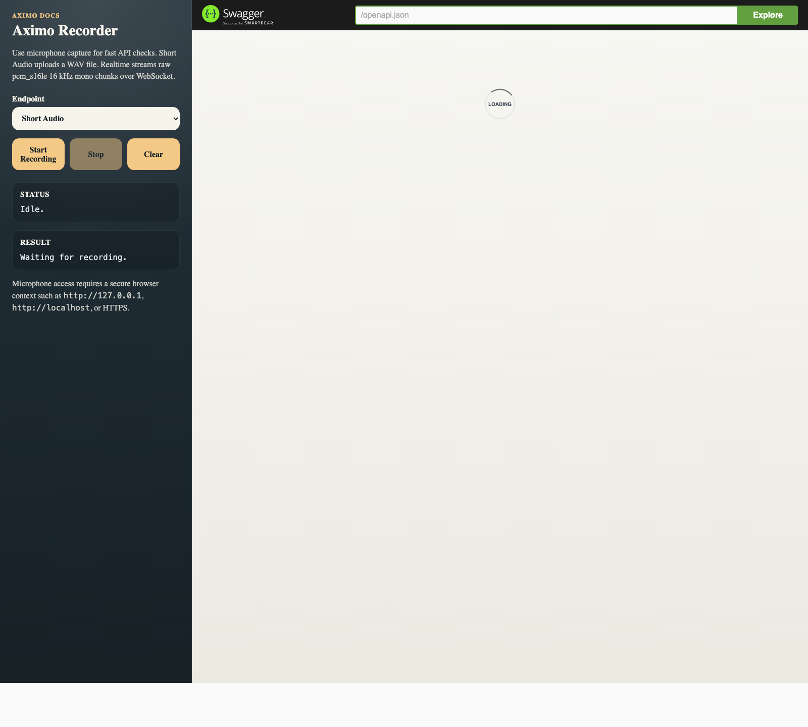

# Aximo

[](https://github.com/agent-axiom/aximo/actions/workflows/ci.yml)

`aximo` is a CPU-first STT microservice for Russian and English built as a Rust Cargo workspace. It exposes:

- `POST /v1/transcriptions` for short audio
- `GET /v1/realtime` for realtime WebSocket streaming
- `GET /v1/capabilities` for active engine capability metadata
- `GET /health/live` and `GET /health/ready` for liveness/readiness
- `GET /openapi.json` for the OpenAPI schema
- `GET /docs/` for Swagger UI with a built-in microphone recorder panel
- `GET /metrics` for Prometheus-compatible operational metrics

## Workspace

- `crates/aximo`: HTTP and WebSocket service binary
- `crates/aximo-core`: scheduler and shared STT domain types
- `crates/aximo-inference`: `transcribe-rs` adapters for local CPU models
- `crates/aximo-audio`: audio helpers

Architecture and protocol details live in:

- [docs/architecture.md](docs/architecture.md)
- [docs/client-examples.md](docs/client-examples.md)
- [docs/realtime-protocol.md](docs/realtime-protocol.md)
- [docs/model-licenses.md](docs/model-licenses.md)
- [docs/benchmarks.md](docs/benchmarks.md)
- [docs/benchmark-baselines.md](docs/benchmark-baselines.md)
- [docs/kubernetes.md](docs/kubernetes.md)
- [docs/deployment-security.md](docs/deployment-security.md)

## Models

Models are runtime artifacts and must live outside git. The service expects a model root directory configured via [config/aximo.example.toml](config/aximo.example.toml).

Compatible model bundles for the current `transcribe-rs` integration:

- Parakeet int8 ONNX bundle: [blob.handy.computer/parakeet-v3-int8.tar.gz](https://blob.handy.computer/parakeet-v3-int8.tar.gz)
- Parakeet int8 ONNX bundle on Hugging Face: [istupakov/parakeet-tdt-0.6b-v3-onnx](https://huggingface.co/istupakov/parakeet-tdt-0.6b-v3-onnx/tree/main)
- GigaAM v3 ONNX bundle on Hugging Face: [istupakov/gigaam-v3-onnx](https://huggingface.co/istupakov/gigaam-v3-onnx/tree/main)

Example layout:

```text
/var/lib/aximo/models/
├── parakeet-tdt-0.6b-v3-int8/
└── giga-am-v3/
```

## Quick Start

Download the default `Parakeet` model bundle:

```bash
just setup-models
```

or directly:

```bash
./scripts/fetch-models.sh
```

### Docker Compose

After the model is downloaded to `./var/models`:

```bash
docker compose up --build
```

This uses [docker-compose.yml](docker-compose.yml), mounts `./var/models` into the container, and serves the API on `http://127.0.0.1:8080`.

## Local Run

For local non-Docker usage, use [config/aximo.local.toml](config/aximo.local.toml), which points to `./var/models`:

```bash
AXIMO_CONFIG=config/aximo.local.toml cargo run -p aximo
```

For containerized usage, [config/aximo.example.toml](config/aximo.example.toml) remains the default and expects models at `/var/lib/aximo/models`.

## Configuration

`AXIMO_CONFIG` points to a TOML config file. If it is not set, built-in defaults are used. Individual fields can be overridden with environment variables after the TOML file is loaded, which is useful for Docker and Kubernetes deployments:

```bash
AXIMO_SERVER_HOST=0.0.0.0
AXIMO_SERVER_PORT=8080
AXIMO_SHUTDOWN_GRACE_PERIOD_MS=30000
AXIMO_MODELS_DIR=/var/lib/aximo/models
AXIMO_DEFAULT_OFFLINE_ENGINE=parakeet
AXIMO_DEFAULT_REALTIME_ENGINE=parakeet
AXIMO_MAX_SHORT_AUDIO_REQUESTS=8
AXIMO_MAX_SHORT_AUDIO_BYTES=25000000
AXIMO_MAX_SHORT_RAW_PCM_BYTES=1920000
AXIMO_MAX_SHORT_AUDIO_DURATION_MS=60000
AXIMO_MAX_SHORT_DECODED_SAMPLES=5760000
AXIMO_MAX_REALTIME_SESSIONS=24
AXIMO_MAX_SHORT_INFERENCES=1
AXIMO_MAX_REALTIME_INFERENCES=1
AXIMO_MAX_REALTIME_SESSION_BYTES=1920000
AXIMO_MAX_REALTIME_SESSION_DURATION_MS=60000
AXIMO_REALTIME_PARTIAL_MIN_INTERVAL_MS=300
AXIMO_REALTIME_PARTIAL_MIN_CHUNK_BYTES=9600
AXIMO_REALTIME_EVENT_CHANNEL_CAPACITY=64
AXIMO_SHORT_INFERENCE_TIMEOUT_MS=120000
AXIMO_REALTIME_PARTIAL_TIMEOUT_MS=5000
AXIMO_REALTIME_FINAL_TIMEOUT_MS=120000
AXIMO_RUNTIME_DEGRADE_AFTER_CONSECUTIVE_FAILURES=3
AXIMO_RUNTIME_DEGRADED_POLICY=readiness_only
AXIMO_RUNTIME_DEGRADED_RECOVERY_COOLDOWN_MS=30000
```

## Capabilities

`GET /v1/capabilities` reports the active offline and realtime engine contract. Use this endpoint before relying on optional response metadata or native streaming behavior:

```bash
curl http://127.0.0.1:8080/v1/capabilities
```

Example response:

```json
{
  "offline": {
    "configured_engine": "parakeet",
    "mode": "offline",
    "model": {
      "engine": "parakeet",
      "model_name": "Parakeet",
      "sample_rate_hz": 16000,
      "languages": ["en"],
      "supports_timestamps": true,
      "supports_language_detection": false,
      "supports_native_streaming": false
    }
  },
  "realtime": {
    "configured_engine": "parakeet",
    "mode": "bounded_buffered_offline",
    "model": {
      "engine": "parakeet",
      "model_name": "Parakeet",
      "sample_rate_hz": 16000,
      "languages": ["en"],
      "supports_timestamps": true,
      "supports_language_detection": false,
      "supports_native_streaming": false
    }
  }
}
```

For the current local ONNX adapters, Parakeet reports English with timestamps and GigaAM reports Russian without timestamps. Neither exposes language detection or native incremental streaming through `transcribe-rs` 0.3.x. Aximo now has a backend extension point for native streaming sessions and automatically switches the realtime WebSocket path to it when the configured backend reports `supports_native_streaming=true`; the bundled Parakeet/GigaAM adapters correctly stay on bounded buffered realtime.

## Short Audio Example

Short transcription currently accepts:

- `audio/wav`
- `audio/mpeg`
- `audio/flac`
- `audio/mp4`
- `audio/x-m4a`
- `audio/pcm`
- `application/octet-stream`

Compressed/container formats are decoded and normalized before inference. `audio/pcm` and `application/octet-stream` are still interpreted as raw `pcm_s16le`, `16 kHz`, mono audio. Short-audio ingest is bounded by HTTP body size, raw PCM byte size, decoded sample count, and decoded duration; limit violations return `413 Payload Too Large`.
Short-audio inference is also bounded by `short_inference_timeout_ms`; timeout responses use `504 Gateway Timeout` with code `inference_timeout`.

```bash
curl -X POST http://127.0.0.1:8080/v1/transcriptions \
  -H 'content-type: audio/wav' \
  --data-binary @sample.wav
```

Optional query parameters are accepted for API compatibility and forwarded to the engine request:

- `engine`: must match the configured short-audio engine for this service instance, for example `parakeet`.
- `language` or `language_hint`: optional backend language hint such as `ru`, `en`, or `auto`; `language_hint` wins when both are supplied.
- `timestamps`: requests timestamp metadata when the backend supports it. Parakeet can return backend-provided segments; GigaAM may still return an empty `segments` array.

```bash
curl -X POST 'http://127.0.0.1:8080/v1/transcriptions?engine=parakeet&language=ru&timestamps=true' \
  -H 'content-type: audio/wav' \
  --data-binary @sample.wav
```

Example response:

```json
{
  "text": "hello world",
  "segments": [],
  "detected_language": null,
  "engine": "parakeet",
  "duration_ms": 1000,
  "processing_ms": 37
}
```

With the current `transcribe-rs` ONNX adapters used here, `detected_language` is `null` when language detection is not exposed. `segments` is populated only when `timestamps=true` and the selected backend returns real segment metadata. `duration_ms` and `processing_ms` are measured values and vary per request.

Error responses from `POST /v1/transcriptions` are structured JSON:

```json
{
  "code": "invalid_audio",
  "message": "invalid audio payload: pcm payload must be aligned to 16-bit samples"
}
```

Unsupported short-audio media types return `415 Unsupported Media Type` with code `unsupported_media_type`. Malformed payloads for supported media types remain `400 invalid_audio`.

## Realtime Example

Realtime uses WebSocket and raw `pcm_s16le`, `16 kHz`, mono binary chunks. If `/v1/capabilities` reports `supports_native_streaming=true`, the WebSocket handler creates a stateful native streaming session and routes chunk/final calls through a bounded native streaming worker with timeout and backpressure handling, so backend calls do not run directly inside the WebSocket loop. Otherwise, Aximo uses bounded buffered realtime.
For bounded buffered realtime, partial hypotheses are computed from a bounded rolling recent window and use latest-wins coalescing under load, so they favor freshness over a steady partial cadence. The final transcription on `stop` waits for the realtime inference slot and runs over the full bounded session buffer.
Admission limits and inference limits are configured separately: `max_short_audio_requests` and `max_realtime_sessions` bound accepted work, while `max_short_inferences` and `max_realtime_inferences` bound per-path inference admission. Actual backend execution is additionally protected by a per-engine model gate, shared when offline and realtime reuse the same engine instance.
Current CPU model execution is safety-first: one loaded model instance has one execution slot. Increase throughput by running more service replicas or, in a future worker-pool design, by loading multiple model replicas.
Realtime server events are sent through a bounded per-socket queue; clients that stop reading can be disconnected instead of accumulating unbounded memory.
Realtime chunks must be aligned to `pcm_s16le` sample width; odd-length binary frames return `invalid_audio_chunk`.
Realtime partial and final inference have separate timeout budgets. A timeout returns an `inference_timeout` event, but the underlying blocking backend call may continue until it returns because Rust cannot safely kill that OS thread. The per-engine model gate stays held until that backend call actually exits, so timed-out calls cannot admit unlimited follow-up backend executions. Native streaming health is tracked separately for stream start, partial chunk handling, and finalization through `realtime_stream:<engine>`, `realtime_partial:<engine>`, and `realtime_final:<engine>`.

```js
const ws = new WebSocket("ws://127.0.0.1:8080/v1/realtime");
ws.binaryType = "arraybuffer";

ws.addEventListener("message", (event) => {
  console.log("server:", event.data);
});

ws.addEventListener("open", async () => {
  ws.send(JSON.stringify({ event: "start" }));

  const pcmChunk = new Uint8Array([0, 0, 1, 0, 2, 0, 3, 0]);
  ws.send(pcmChunk);

  ws.send(JSON.stringify({ event: "stop" }));
});
```

Expected server events:

- `session_started`
- `partial`
- `final`
- `error`

`error` events now include machine-readable `code` and human-readable `reason`, for example:

```json
{
  "event": "error",
  "code": "realtime_capacity_exhausted",
  "reason": "realtime session capacity exhausted"
}
```

## API Docs

After the service starts:

- Swagger UI: [http://127.0.0.1:8080/docs/](http://127.0.0.1:8080/docs/)
- OpenAPI JSON: [http://127.0.0.1:8080/openapi.json](http://127.0.0.1:8080/openapi.json)
- Metrics: [http://127.0.0.1:8080/metrics](http://127.0.0.1:8080/metrics)
- Client examples: [docs/client-examples.md](docs/client-examples.md)

The `/docs/` page also includes an `Aximo Recorder` panel that can capture microphone audio in the browser:

- `Short Audio` records locally, converts to WAV, and sends the result to `POST /v1/transcriptions`
- `Realtime` downsamples to `pcm_s16le 16 kHz mono` and streams binary chunks to `GET /v1/realtime`

For browser microphone access, use `localhost`, `127.0.0.1`, or HTTPS.

One notable addition: I extended Swagger to support sending recordings directly from the microphone.



## Troubleshooting

If container logs include `onnxruntime cpuid_info warning: Unknown CPU vendor`, this is typically an ONNX Runtime CPU detection warning on ARM or virtualized environments, not a model-load failure. The container now sets `ORT_LOG=error` to reduce that noise in normal runs.

## Metrics

`GET /metrics` exposes lightweight Prometheus text metrics for operational visibility:

- `aximo_http_requests_total{status,code}`
- `aximo_errors_total{code}`
- `aximo_audio_body_bytes_total`
- `aximo_audio_decode_seconds_bucket/sum/count`
- `aximo_audio_duration_seconds_bucket/sum/count`
- `aximo_inference_wait_seconds_bucket/sum/count{kind}`
- `aximo_model_execution_wait_seconds_bucket/sum/count{kind}`
- `aximo_inference_seconds_bucket/sum/count{kind}`
- `aximo_rtf_bucket/sum/count{kind}`
- `aximo_inference_timeouts_total{kind}`
- `aximo_blocking_tasks_active`
- `aximo_model_executions_active`
- `aximo_runtime_degraded`
- `aximo_runtime_consecutive_failures`
- `aximo_runtime_component_degraded{component}`
- `aximo_runtime_component_consecutive_failures{component}`
- `aximo_ws_sessions_active`
- `aximo_ws_queue_overflows_total`
- `aximo_realtime_partial_coalesced_total`
- `aximo_realtime_stale_partial_skips_total`
- `aximo_model_execution_wait_timeouts_total`

Latency and RTF metrics are emitted as Prometheus histograms, so dashboards can use `histogram_quantile()` for p95/p99 without depending only on averages.

`/health/live` is process liveness. `/health/ready` reports aggregate readiness and per-component details such as `short:parakeet`, `realtime_partial:parakeet`, and `realtime_final:parakeet`. It returns `503` with a JSON `degraded` status after consecutive timeout/runtime/unavailable inference failures for any component reach `runtime_degrade_after_consecutive_failures`. A successful inference clears only its own component state. `runtime_degraded_policy = "readiness_only"` only signals orchestrators through readiness; `runtime_degraded_policy = "fail_fast_inference"` additionally rejects new inference work for degraded components with `engine_degraded`, then allows one half-open recovery probe after `runtime_degraded_recovery_cooldown_ms`. Client-side errors that stop a half-open probe before inference consume the probe window and restart the cooldown without changing the prior engine failure reason.

On SIGINT or SIGTERM, Aximo notifies active websocket handlers, sends close frames, stops accepting new connections through axum graceful shutdown, and waits up to `shutdown_grace_period_ms`.

## Known Limits

- Realtime uses a native streaming session only when `/v1/capabilities` reports `supports_native_streaming=true`; Parakeet and GigaAM currently report `false`, so they intentionally use bounded buffered realtime.
- Native streaming currently uses one native worker thread per active native streaming session. This keeps backend calls out of the WebSocket loop, but high native-streaming session counts must be benchmarked before raising `max_realtime_sessions`.
- `segments` is backend-dependent and only returned when `timestamps=true`; `detected_language` stays `null` while `/v1/capabilities` reports `supports_language_detection=false`.
- Container decode now avoids an extra input-buffer copy from axum `Bytes`, but decoded samples are still materialized in memory before normalization.
- Audio resampling now uses a bounded windowed-sinc path, but production WER/CER work should still validate preprocessing quality against real audio.
- Remaining product work is backend-driven: plug in a backend that exposes language detection when that capability is required.

## Development

Common checks:

```bash
just fmt
just lint
just test
just coverage
just setup-models
```

## Container Releases

The `Container` GitHub Actions workflow publishes `ghcr.io/agent-axiom/aximo` on pushes to `main`, semantic version tags such as `v0.1.0`, and manual dispatch. Tags include branch, semver, major/minor, and git SHA variants. The image intentionally does not include model files; mount a model directory and provide `AXIMO_CONFIG` as shown in the Docker Compose example.
Container builds request BuildKit SBOM and provenance attestations.

## Security

Security reporting is documented in [SECURITY.md](SECURITY.md). The `Security` GitHub Actions workflow runs `cargo audit`, `cargo deny check`, and CycloneDX SBOM generation.

Aximo should not be exposed directly to untrusted clients without an authenticated ingress or API gateway. Use [docs/deployment-security.md](docs/deployment-security.md) for ingress authentication, mTLS/API-key/JWT options, and rate limiting guidance.

## crates.io

The publishable library crates are:

- `aximo-core`
- `aximo-audio`
- `aximo-inference`

The `aximo` service crate is intentionally marked `publish = false`.

Use `just package-libs` for the local pre-publish check of `aximo-core` and `aximo-audio`. `aximo-inference` must be dry-run published only after `aximo-core` is already available in the `crates.io` index.

Release workflow notes are documented in [docs/publishing.md](docs/publishing.md).
