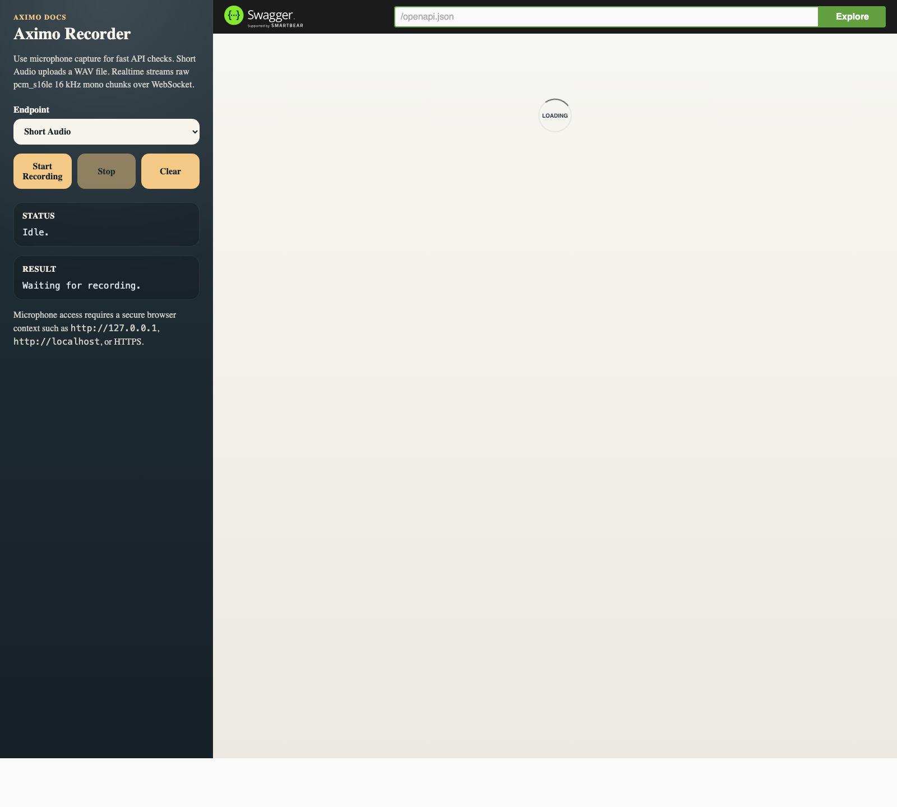

# API reference

See [installation](installation.md) to start Aximo, [client examples](client-examples.md) for integrations, and [realtime protocol](realtime-protocol.md) for the full WebSocket contract.

## Capabilities

`GET /v1/capabilities` reports the active offline and realtime engine contract. Use this endpoint before relying on optional response metadata or native streaming behavior:

```bash
curl http://127.0.0.1:8080/v1/capabilities
```

Example response:

```json
{
  "offline": {
    "configured_engine": "parakeet",
    "mode": "offline",
    "model": {
      "engine": "parakeet",
      "model_name": "Parakeet",
      "sample_rate_hz": 16000,
      "languages": ["en"],
      "supports_timestamps": true,
      "supports_language_detection": false,
      "supports_native_streaming": false
    }
  },
  "realtime": {
    "configured_engine": "parakeet",
    "mode": "bounded_buffered_offline",
    "model": {
      "engine": "parakeet",
      "model_name": "Parakeet",
      "sample_rate_hz": 16000,
      "languages": ["en"],
      "supports_timestamps": true,
      "supports_language_detection": false,
      "supports_native_streaming": false
    }
  }
}
```

For the current local ONNX adapters, Parakeet reports English with timestamps and GigaAM reports Russian without timestamps. Neither exposes language detection or native incremental streaming through `transcribe-rs` 0.3.x. Aximo now has a backend extension point for native streaming sessions and automatically switches the realtime WebSocket path to it when the configured backend reports `supports_native_streaming=true`; the bundled Parakeet/GigaAM adapters correctly stay on bounded buffered realtime.

## Short Audio Example

Short transcription currently accepts:

- `audio/wav`
- `audio/mpeg`
- `audio/flac`
- `audio/mp4`
- `audio/x-m4a`
- `audio/pcm`
- `application/octet-stream`

Compressed/container formats are decoded and normalized before inference. `audio/pcm` and `application/octet-stream` are still interpreted as raw `pcm_s16le`, `16 kHz`, mono audio. Short-audio ingest is bounded by HTTP body size, raw PCM byte size, decoded sample count, and decoded duration; limit violations return `413 Payload Too Large`.
Short-audio inference is also bounded by `short_inference_timeout_ms`; timeout responses use `504 Gateway Timeout` with code `inference_timeout`.

```bash
curl -X POST http://127.0.0.1:8080/v1/transcriptions \
  -H 'content-type: audio/wav' \
  --data-binary @sample.wav
```

Optional query parameters are accepted for API compatibility and forwarded to the engine request:

- `engine`: must match the configured short-audio engine for this service instance, for example `parakeet`.
- `language` or `language_hint`: optional backend language hint such as `ru`, `en`, or `auto`; `language_hint` wins when both are supplied.
- `timestamps`: requests timestamp metadata when the backend supports it. Parakeet can return backend-provided segments; GigaAM may still return an empty `segments` array.

```bash
curl -X POST 'http://127.0.0.1:8080/v1/transcriptions?engine=parakeet&language=ru&timestamps=true' \
  -H 'content-type: audio/wav' \
  --data-binary @sample.wav
```

Example response:

```json
{
  "text": "hello world",
  "segments": [],
  "detected_language": null,
  "engine": "parakeet",
  "duration_ms": 1000,
  "processing_ms": 37
}
```

With the current `transcribe-rs` ONNX adapters used here, `detected_language` is `null` when language detection is not exposed. `segments` is populated only when `timestamps=true` and the selected backend returns real segment metadata. `duration_ms` and `processing_ms` are measured values and vary per request.

Error responses from `POST /v1/transcriptions` are structured JSON:

```json
{
  "code": "invalid_audio",
  "message": "invalid audio payload: pcm payload must be aligned to 16-bit samples"
}
```

Unsupported short-audio media types return `415 Unsupported Media Type` with code `unsupported_media_type`. Malformed payloads for supported media types remain `400 invalid_audio`.

## Realtime Example

Realtime uses WebSocket and raw `pcm_s16le`, `16 kHz`, mono binary chunks. If `/v1/capabilities` reports `supports_native_streaming=true`, the WebSocket handler creates a stateful native streaming session and routes chunk/final calls through a bounded native streaming worker with timeout and backpressure handling, so backend calls do not run directly inside the WebSocket loop. Otherwise, Aximo uses bounded buffered realtime.
For bounded buffered realtime, partial hypotheses are computed from a bounded rolling recent window and use latest-wins coalescing under load, so they favor freshness over a steady partial cadence. The final transcription on `stop` waits for the realtime inference slot and runs over the full bounded session buffer.
Admission limits and inference limits are configured separately: `max_short_audio_requests` and `max_realtime_sessions` bound accepted work, while `max_short_inferences` and `max_realtime_inferences` bound per-path inference admission. Actual backend execution is additionally protected by a per-engine model gate, shared when offline and realtime reuse the same engine instance.
Current CPU model execution is safety-first: one loaded model instance has one execution slot. Increase throughput by running more service replicas or, in a future worker-pool design, by loading multiple model replicas.
Realtime server events are sent through a bounded per-socket queue; clients that stop reading can be disconnected instead of accumulating unbounded memory.
Realtime chunks must be aligned to `pcm_s16le` sample width; odd-length binary frames return `invalid_audio_chunk`.
Realtime partial and final inference have separate timeout budgets. A timeout returns an `inference_timeout` event, but the underlying blocking backend call may continue until it returns because Rust cannot safely kill that OS thread. The per-engine model gate stays held until that backend call actually exits, so timed-out calls cannot admit unlimited follow-up backend executions. Native streaming health is tracked separately for stream start, partial chunk handling, and finalization through `realtime_stream:<engine>`, `realtime_partial:<engine>`, and `realtime_final:<engine>`.

```js
const ws = new WebSocket("ws://127.0.0.1:8080/v1/realtime");
ws.binaryType = "arraybuffer";

ws.addEventListener("message", (event) => {
  console.log("server:", event.data);
});

ws.addEventListener("open", async () => {
  ws.send(JSON.stringify({ event: "start" }));

  const pcmChunk = new Uint8Array([0, 0, 1, 0, 2, 0, 3, 0]);
  ws.send(pcmChunk);

  ws.send(JSON.stringify({ event: "stop" }));
});
```

Expected server events:

- `session_started`
- `partial`
- `final`
- `error`

`error` events now include machine-readable `code` and human-readable `reason`, for example:

```json
{
  "event": "error",
  "code": "realtime_capacity_exhausted",
  "reason": "realtime session capacity exhausted"
}
```

## API Docs

After the service starts:

- Swagger UI: [http://127.0.0.1:8080/docs/](http://127.0.0.1:8080/docs/)
- OpenAPI JSON: [http://127.0.0.1:8080/openapi.json](http://127.0.0.1:8080/openapi.json)
- Metrics: [http://127.0.0.1:8080/metrics](http://127.0.0.1:8080/metrics)
- Client examples: [client examples](client-examples.md)

The `/docs/` page also includes an `Aximo Recorder` panel that can capture microphone audio in the browser:

- `Short Audio` records locally, converts to WAV, and sends the result to `POST /v1/transcriptions`
- `Realtime` downsamples to `pcm_s16le 16 kHz mono` and streams binary chunks to `GET /v1/realtime`

For browser microphone access, use `localhost`, `127.0.0.1`, or HTTPS.


