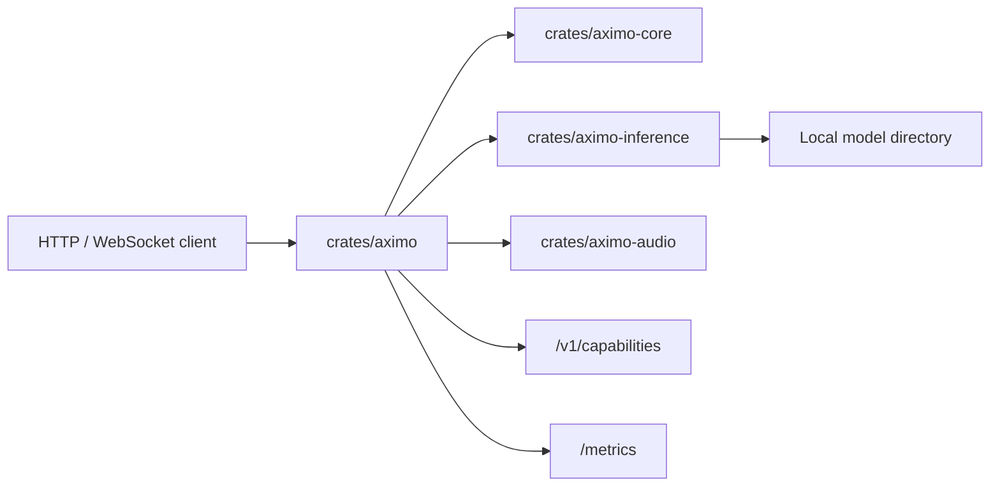
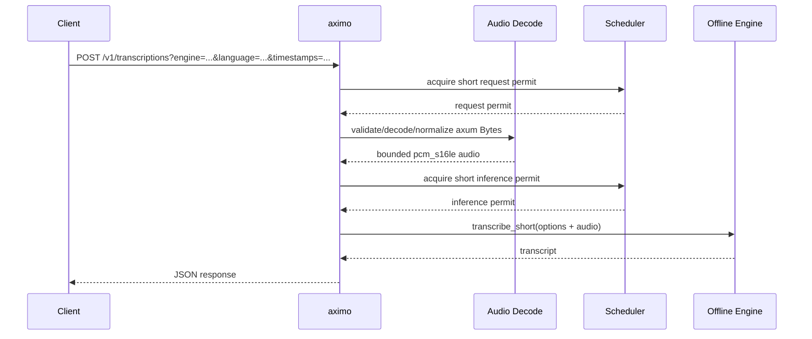
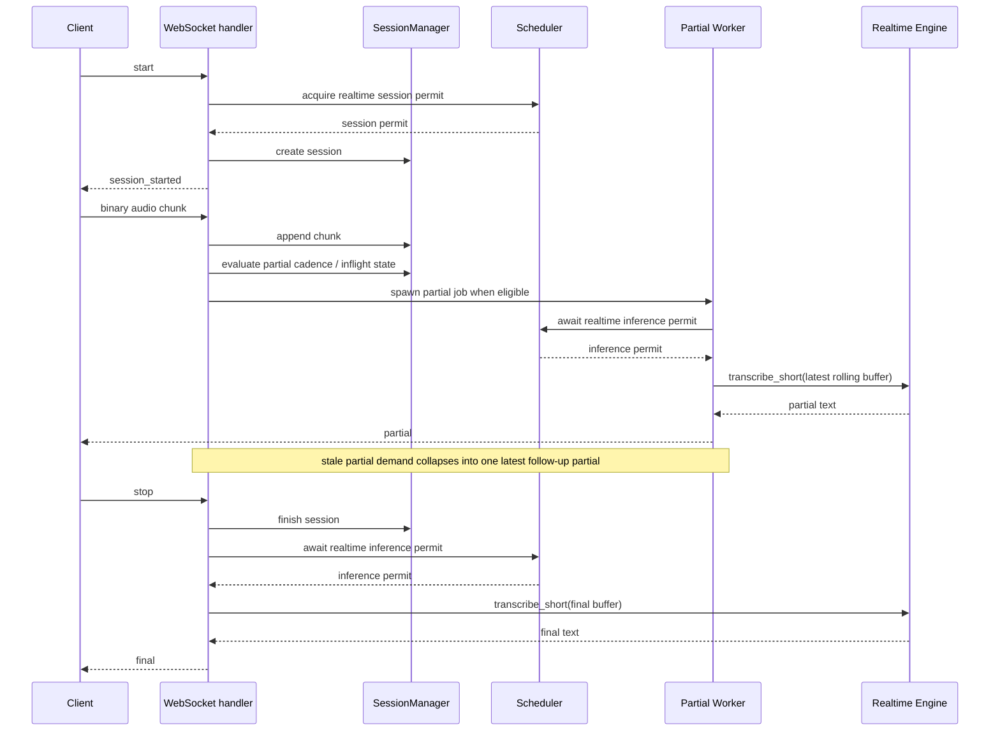

# Aximo Architecture

`aximo` is a CPU-first STT microservice for Russian and English built as a Cargo workspace.

## Components

## Request Flow

### Short Audio

### Realtime

Realtime is intentionally implemented as bounded buffered realtime. The service accepts live WebSocket chunks and emits partial/final events, but the current `transcribe-rs` path still runs bounded offline decodes rather than a true incremental streaming decoder.

## Runtime Model Convention

- Models live outside git.
- `Settings.inference.models_dir` points to the root directory.
- `default_offline_engine` and `default_realtime_engine` choose named engines from config.
- The current implementation supports `parakeet` and `gigaam` through `transcribe-rs`.
- `max_short_audio_requests` and `max_realtime_sessions` bound admitted work.
- `max_short_inferences` and `max_realtime_inferences` bound per-path inference admission and should reflect how much work the service should queue toward each path.
- When the same offline and realtime engine config resolves to the same backend/model path, Aximo reuses one engine instance to avoid loading duplicate model copies. That saves RAM. Actual backend calls are additionally protected by a per-engine execution gate that is shared by offline and realtime when they share an engine `Arc`; the gate remains held until a blocking backend call exits, even if the client already received a timeout.
- One loaded model instance has one execution slot. The short/realtime inference limits are admission-level controls; real model parallelism requires more service replicas or a future multi-replica engine worker pool.
- `POST /v1/transcriptions` accepts `engine`, `language`/`language_hint`, and `timestamps` query options. `engine` must match the configured offline engine for the service instance; metadata options are forwarded but remain backend-capability dependent.
- `GET /v1/capabilities` reports the active offline/realtime model capabilities from the backend adapter, including supported languages, timestamp support, language-detection support, and native streaming support.
- Short-audio container decode takes axum `Bytes` directly to avoid an extra input-buffer copy. Decoded samples are still materialized in memory before normalization and are bounded by configured sample/duration/body limits.
- Realtime partials are best-effort and latest-wins under saturation; final transcriptions remain strict and run against the full bounded session buffer.
- `segments` and `detected_language` are capability-dependent response fields. Aximo maps real `transcribe-rs` segment metadata when `timestamps=true` and the backend provides it. `detected_language` remains `null` while `/v1/capabilities` reports `supports_language_detection=false`.

## Observability

`GET /metrics` returns Prometheus-compatible text metrics for request status/code counts, error codes, audio body size, decoded audio duration, decode time, scheduler wait, model execution wait, model-gate wait timeouts, inference wall time, realtime factor, inference timeouts, active blocking tasks, active model executions, runtime component health, active websocket sessions, queue overflows, stale partial skips, and coalesced realtime partials. Decode, duration, wait, inference, and RTF series are emitted as histograms with `_bucket`, `_sum`, and `_count`.

`GET /health/live` is process liveness. `GET /health/ready` reflects runtime health and returns `503` after consecutive timeout/runtime/unavailable inference failures cross the configured degradation threshold for any component. Health is tracked per component key, for example `short:parakeet`, `realtime_partial:parakeet`, and `realtime_final:parakeet`; successful inference clears only the component that succeeded.

`runtime_degraded_policy` controls whether degraded state is only an orchestrator signal or also a request admission policy. `readiness_only` preserves Kubernetes-style behavior where readiness removes the pod from service endpoints but direct callers can still retry. `fail_fast_inference` rejects new short-audio requests or realtime session starts for degraded engine paths with `engine_degraded`, then allows one half-open recovery probe after `runtime_degraded_recovery_cooldown_ms`. If a half-open probe fails with a client-side error before reaching inference, Aximo consumes that probe window and restarts the cooldown while preserving the previous engine failure reason.
