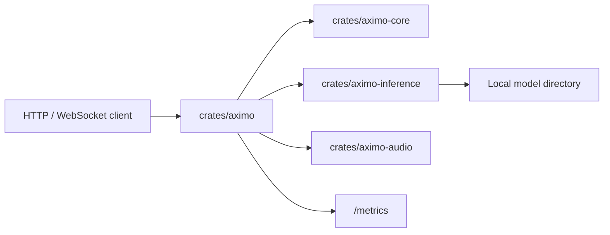
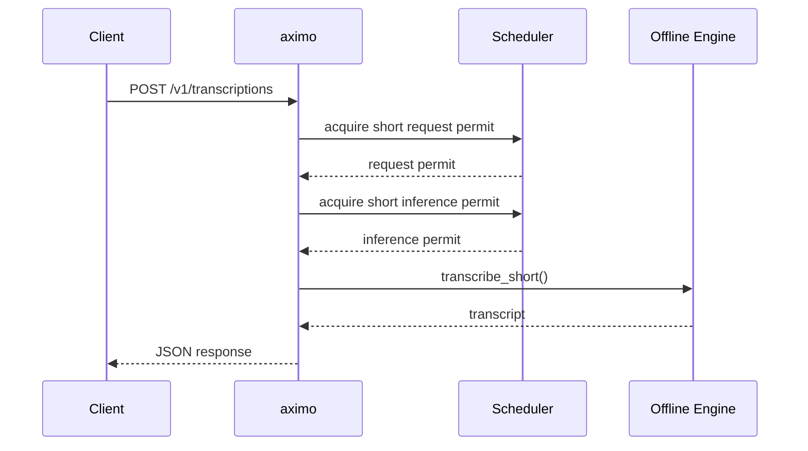
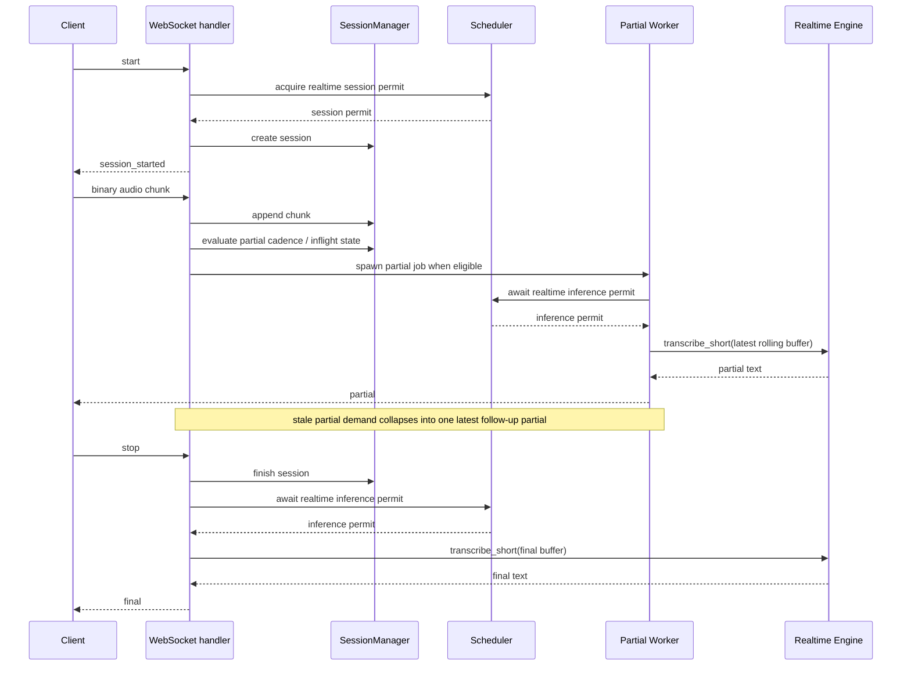

# Aximo Architecture

`aximo` is a CPU-first STT microservice for Russian and English built as a Cargo workspace.

## Components

## Request Flow

### Short Audio

### Realtime

Realtime is intentionally implemented as bounded buffered realtime. The service accepts live WebSocket chunks and emits partial/final events, but the current `transcribe-rs` path still runs bounded offline decodes rather than a true incremental streaming decoder.

## Runtime Model Convention

- Models live outside git.
- `Settings.inference.models_dir` points to the root directory.
- `default_offline_engine` and `default_realtime_engine` choose named engines from config.
- The current implementation supports `parakeet` and `gigaam` through `transcribe-rs`.
- `max_short_audio_requests` and `max_realtime_sessions` bound admitted work.
- `max_short_inferences` and `max_realtime_inferences` bound per-path inference admission and should reflect how much work the service should queue toward each path.
- When the same offline and realtime engine config resolves to the same backend/model path, Aximo reuses one engine instance to avoid loading duplicate model copies. That saves RAM. Actual backend calls are additionally protected by a per-engine execution gate that is shared by offline and realtime when they share an engine `Arc`; the gate remains held until a blocking backend call exits, even if the client already received a timeout.
- Realtime partials are best-effort and latest-wins under saturation; final transcriptions remain strict and run against the full bounded session buffer.
- `segments` and `detected_language` are capability-dependent response fields. The current `transcribe-rs` ONNX adapter path exposes plain transcript text, measured duration, and measured processing time, but not segment timestamps or real language detection.

## Observability

`GET /metrics` returns Prometheus-compatible text metrics for request status/code counts, error codes, audio body size, decoded audio duration, decode time, scheduler wait, model execution wait, inference wall time, realtime factor, inference timeouts, active blocking tasks, active model executions, active websocket sessions, queue overflows, stale partial skips, and coalesced realtime partials.

`GET /health/live` is process liveness. `GET /health/ready` reflects runtime health and returns `503` after consecutive timeout/runtime/unavailable inference failures cross the configured degradation threshold.
