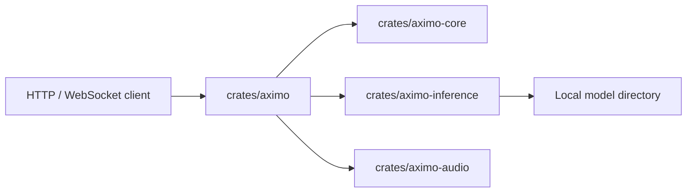
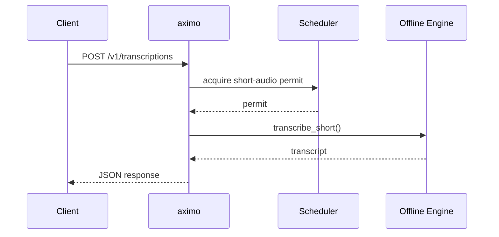
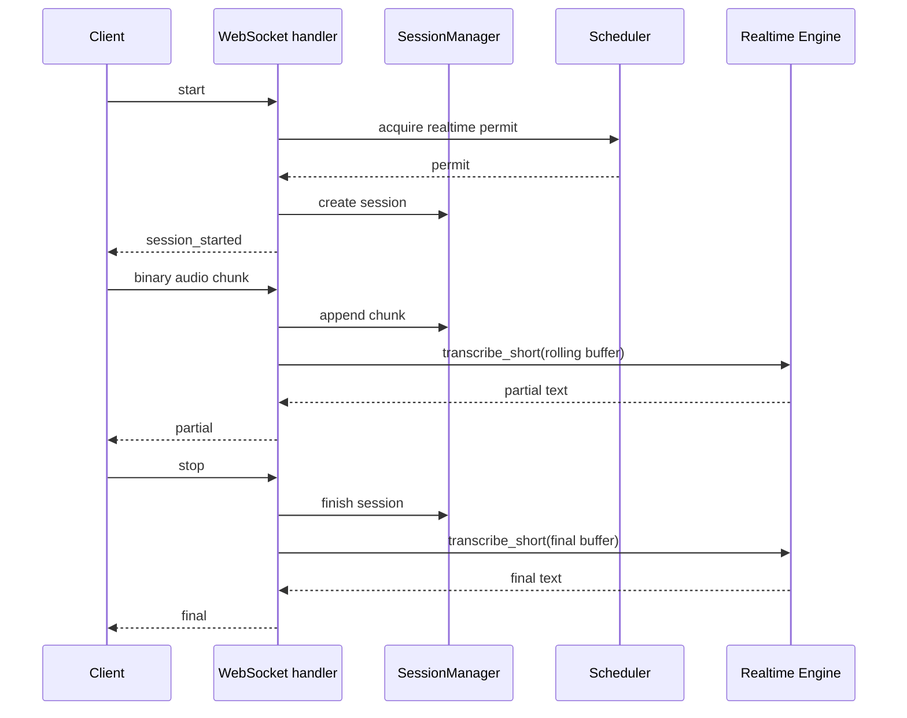

# Aximo Architecture

`aximo` is a CPU-first STT microservice for Russian and English built as a Cargo workspace.

## Components

## Request Flow

### Short Audio

### Realtime

## Runtime Model Convention

- Models live outside git.
- `Settings.inference.models_dir` points to the root directory.
- `default_offline_engine` and `default_realtime_engine` choose named engines from config.
- The current implementation supports `parakeet` and `gigaam` through `transcribe-rs`.
