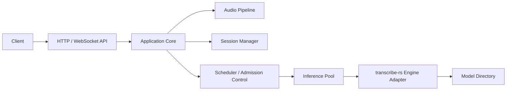
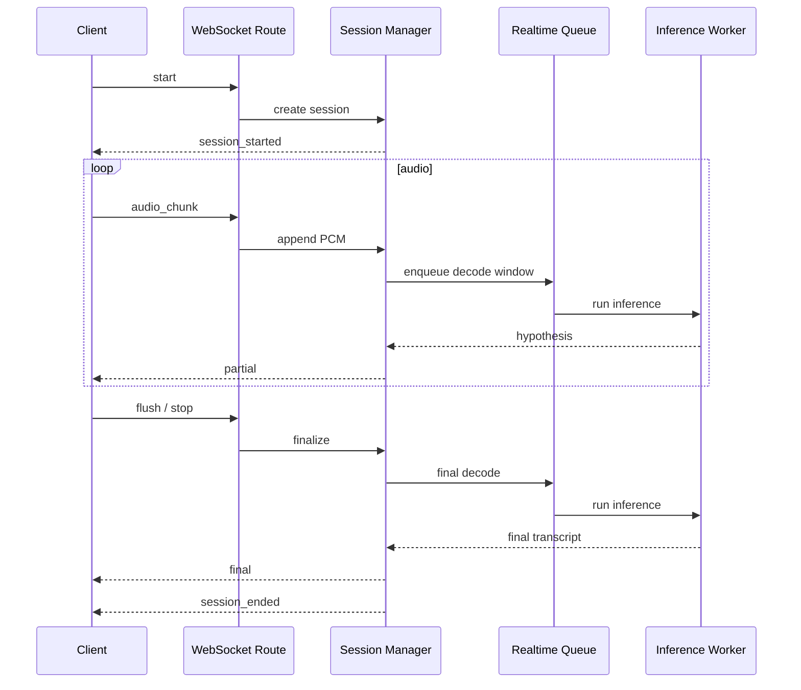
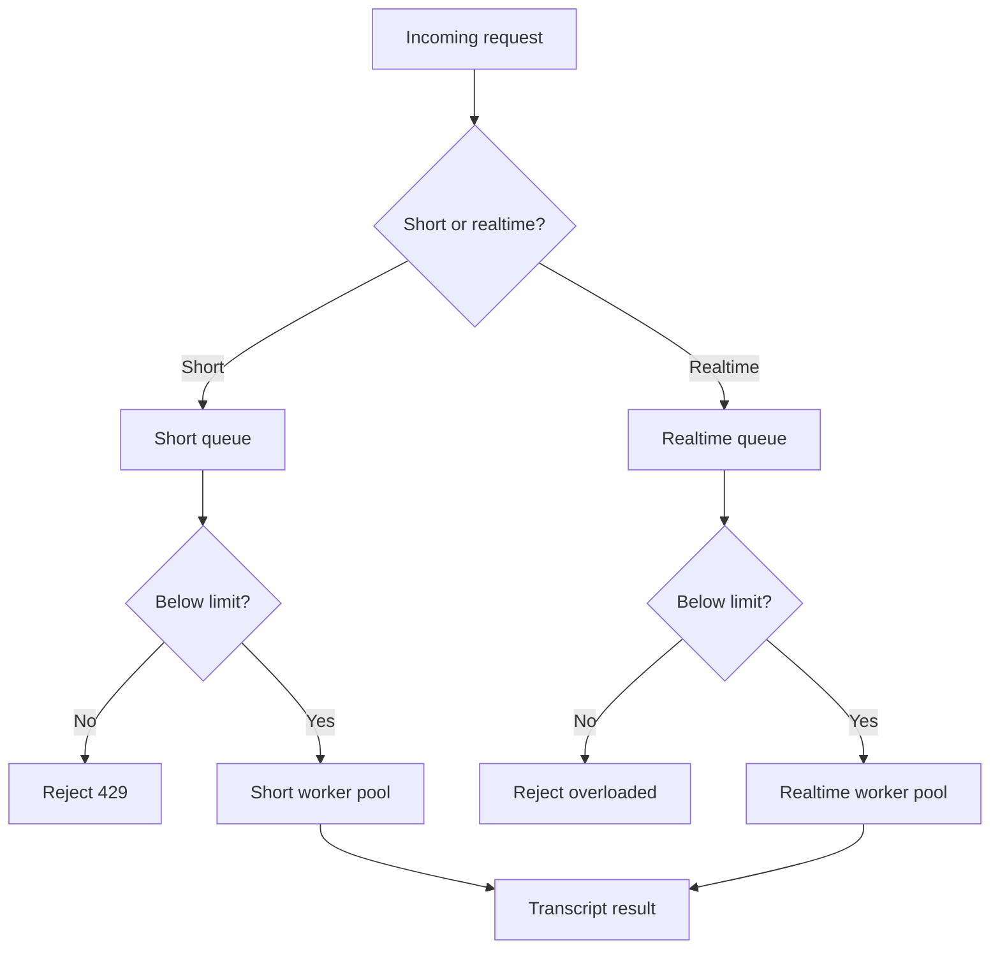

# Aximo STT Service Design

## Goal

Build a CPU-first speech-to-text microservice for Russian and English with:

- one synchronous API for short audio files
- one real-time streaming API
- local model execution only
- clear model/runtime separation from source code
- operational guardrails for 10-50 concurrent real-time sessions

## Scope

### In Scope

- Rust HTTP/WebSocket service
- inference integration through `transcribe-rs`
- `Parakeet v3` as default bilingual engine
- `GigaAM v3` as optional Russian-focused engine
- offline short-audio transcription
- real-time chunked streaming with partial and final hypotheses
- testable workspace structure and tooling

### Out of Scope for v1

- GPU execution
- diarization
- speaker identification
- translation
- persistent job queue
- browser SDK
- automatic model download

## Constraints

- Models are not stored in git.
- Service runs on CPU only.
- Short-audio endpoint targets files up to 60 seconds.
- Real-time endpoint accepts only `pcm_s16le`, `16kHz`, `mono`.
- Admission control is required; the service must reject load above configured capacity instead of degrading indefinitely.

## Licensing

- `transcribe-rs` is MIT licensed.
- `Parakeet TDT 0.6B v3` is licensed under CC BY 4.0 and requires attribution in documentation and deployment metadata.
- `GigaAM v3` is MIT licensed.

The service must document the active engine and model license in both operator docs and runtime metadata.

## High-Level Architecture



## Workspace Structure

```text
repo/
├── Cargo.toml
├── justfile
├── rust-toolchain.toml
├── .cargo/config.toml
├── config/
│   └── aximo.example.toml
├── crates/
│   ├── aximo/
│   ├── aximo-core/
│   ├── aximo-inference/
│   └── aximo-audio/
├── docs/
└── tests/
```

## Runtime Model Layout

Models are configured by path and live outside the source workspace.

```text
/var/lib/aximo/models/
├── parakeet-tdt-0.6b-v3-int8/
│   ├── encoder-model.int8.onnx
│   ├── decoder_joint-model.int8.onnx
│   ├── nemo128.onnx
│   └── vocab.txt
└── giga-am-v3/
    ├── model.onnx
    └── vocab.txt
```

## Crate Boundaries

### `crates/aximo`

Owns:

- application bootstrap
- configuration loading
- HTTP routes
- WebSocket protocol handling
- OpenAPI generation

Does not own:

- inference implementation details
- audio transformation internals
- scheduling policy primitives

### `crates/aximo-core`

Owns:

- use cases
- session lifecycle
- quotas and limits
- queueing and admission control
- API-facing domain models

### `crates/aximo-inference`

Owns:

- `transcribe-rs` integration
- engine registry
- model pool
- inference request/response mapping

### `crates/aximo-audio`

Owns:

- decode and validation
- resampling to `16kHz mono`
- real-time chunk windowing
- overlap handling for streaming

## API Design

### `POST /v1/transcriptions`

Purpose:

- transcribe short uploaded audio synchronously

Accepted inputs:

- `multipart/form-data` with `file`
- `application/octet-stream`

Key request fields:

- `engine` optional
- `language_hint` optional with `ru`, `en`, or `auto`
- `timestamps` optional boolean

Response fields:

- `text`
- `segments`
- `detected_language`
- `engine`
- `duration_ms`
- `processing_ms`

### `GET /v1/realtime`

Transport:

- WebSocket

Client events:

- `start`
- `audio_chunk`
- `flush`
- `stop`

Server events:

- `session_started`
- `partial`
- `final`
- `warning`
- `error`
- `session_ended`

## Real-Time Strategy

`transcribe-rs` clearly exposes offline inference for `Parakeet` and `GigaAM`, while its README explicitly shows a streaming model path only for Moonshine English streaming. For `ru+en`, v1 therefore uses application-level streaming:

- accumulate PCM chunks
- maintain a rolling buffer
- decode on overlapping windows
- reconcile partial results into stable segments

This yields real-time behavior without requiring a model-native bilingual streaming engine.



## Scheduling and Capacity Model

The service must isolate short-file and real-time work.

- Real-time requests get a dedicated bounded queue.
- Short-file requests get a separate bounded queue.
- Each queue has independent worker counts and max in-flight limits.
- If limits are exceeded, the service returns `429` or `1013`-style backpressure instead of silently stalling.



## Configuration

Example runtime configuration:

```toml
[server]
host = "0.0.0.0"
port = 8080

[inference]
models_dir = "/var/lib/aximo/models"
default_offline_engine = "parakeet"
default_realtime_engine = "parakeet"

[inference.engines.parakeet]
path = "parakeet-tdt-0.6b-v3-int8"

[inference.engines.gigaam]
path = "giga-am-v3"

[limits]
max_short_audio_seconds = 60
max_realtime_sessions = 24
max_realtime_buffer_ms = 30000
```

## Observability

The service exposes:

- structured logs via `tracing`
- readiness and liveness health endpoints
- per-endpoint latency metrics
- queue depth metrics
- active-session count
- inference duration by engine

## Testing Strategy

### Unit Tests

- config parsing and validation
- audio normalization and chunk window generation
- session lifecycle transitions
- scheduler admission rules
- result reconciliation

### Integration Tests

- `POST /v1/transcriptions` success and validation errors
- WebSocket session start, chunk upload, flush, stop
- overload and backpressure behavior
- model registry behavior with fake engines

### Property and Snapshot Tests

- property tests for chunk/window invariants
- snapshot tests for JSON event payloads

### Coverage

The workspace target is at least 88% line coverage measured with `cargo llvm-cov`.

## Risks

### Real-Time Accuracy Drift

Application-level streaming on top of offline models can duplicate or oscillate text. Mitigation:

- overlapping decode windows
- stable prefix detection
- delayed finalization rules

### CPU Saturation

10-50 sessions on CPU depends on hardware. Mitigation:

- explicit concurrency limits
- per-role worker pools
- horizontal scale with sticky sessions

### Model Footprint

Large models increase cold-start latency and memory usage. Mitigation:

- eager model warmup
- configurable enabled-engine set

## Acceptance Criteria

- service starts with a configured local model directory
- short-audio endpoint returns transcript and timestamps using a fake engine in tests
- realtime WebSocket endpoint emits partial and final events using a fake engine in tests
- overload protection is covered by tests
- generated OpenAPI matches implemented HTTP schema
- coverage is at least 88%
